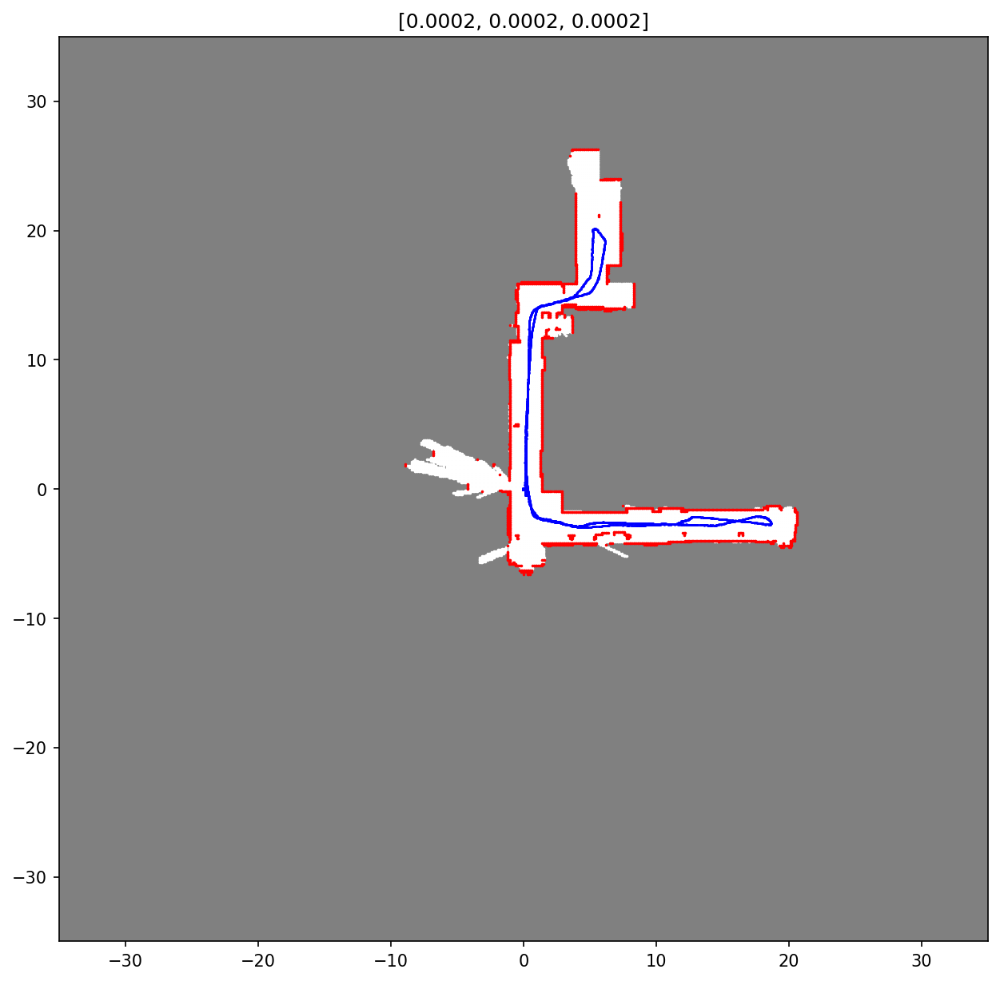
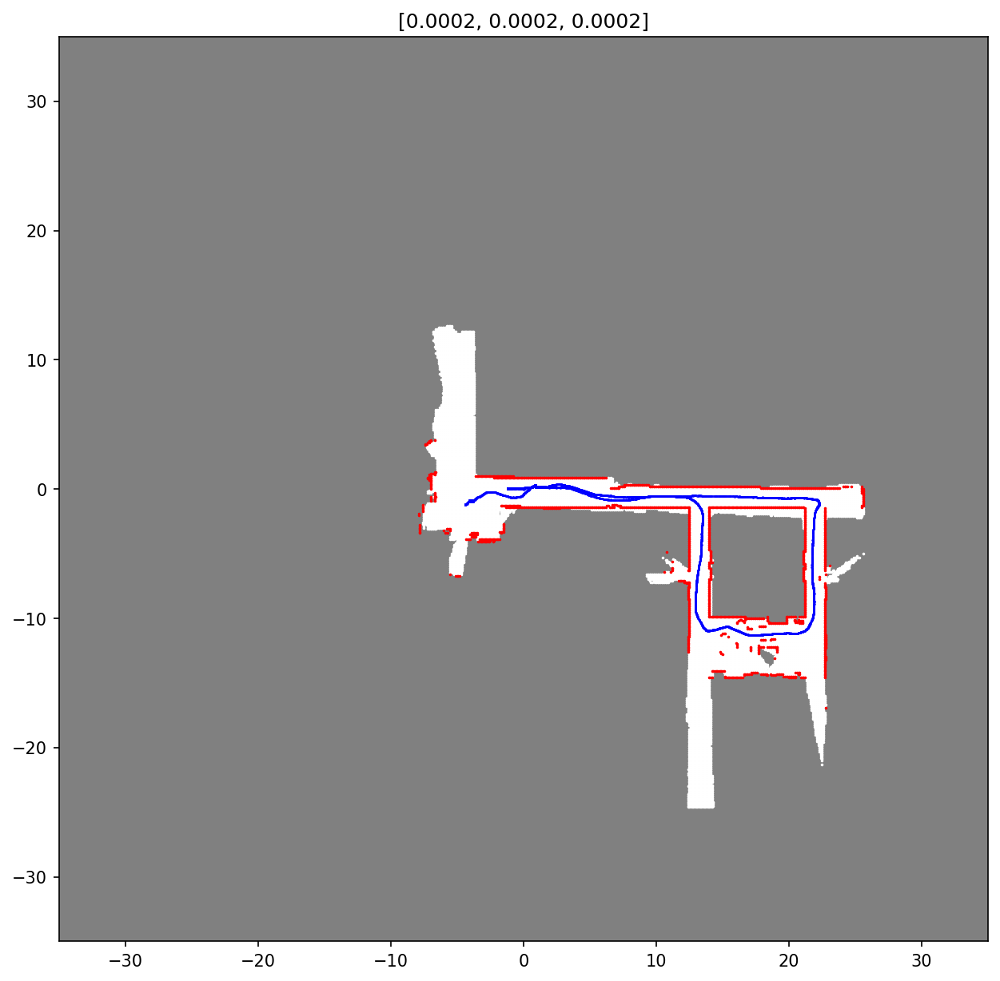

# Robot-SLAM

Use a robot to map out indoor environment using Simultaneous Localisation &amp; Mapping (SLAM). Full details can be found in `Project Report.pdf`.

Example results:

## How to run:

- Put training data files (encoder, lidar, imu) into folder 'test'
- In your terminal, run:
	python slam.py <encoder_filename> <lidar_filename>
- For example:
	python slam.py Encoders20.mat Hokuyo20.mat
